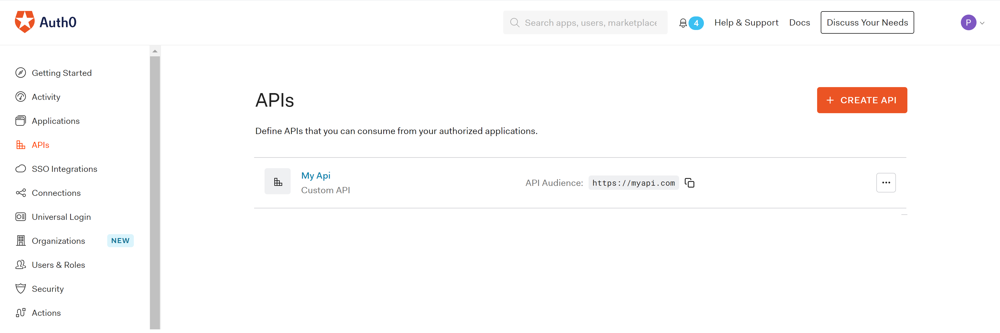
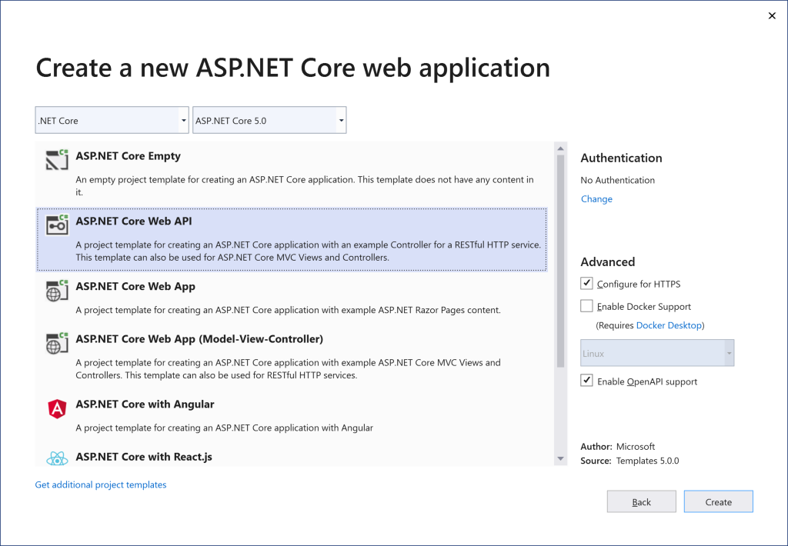
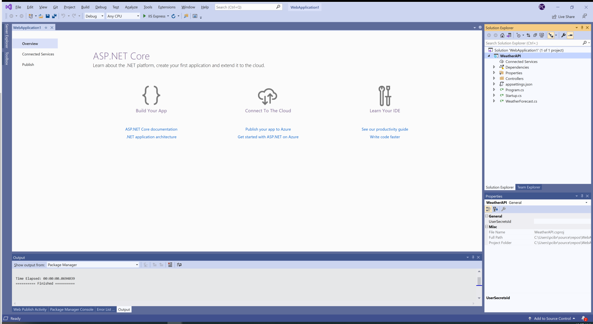

# Backend as Frontend Authentication Pattern with Auth0 and .NET 5.0

## What is the Backend As Frontend Authentication Pattern

As you start looking into the different OAuth flows and the scenarios they cover, client type is one of those relevant aspects mentioned everywhere. The [OAuth 2.1 specification](https://datatracker.ietf.org/doc/html/rfc6749) defines two different client types, public and confidential clients under the section #2.1.

Public clients are those that run in places where secrets could be exposed as part of the source code or if the binaries are decompiled. These usually are single page apps running in a browser, or native apps running in user devices such as mobile phones or smart TVs. 

On other hand, confidential clients are the ones with the ability to keep secrets in a private store. For example, a web application running in a web server, which can store secrets on the backend. 

The client type will determine one or more OAuth flows suitable for the application implementation. By sticking to one of those flows, you  can also ensure your application will be remain secure from authentication standpoint.

The Backend As FrontEnd pattern (a.k.a BFF) for authentication emerged to mitigate any risk that may occur from negotiating and handling access tokens from public clients running in a browser.  The name also implies that a dedicated backend must be available for performing all the authorization code exchange and handling of the access and refresh tokens.

The connection between the application running in the browser (frontend) and backend is a encrypted session cookie, which will rely on a all the protection mechanisms offered by the browser.

This pattern does  work for a pure SPA that relies on calling external APIs directly from javascript or a serveless backend (e.g AWS Lamba or Azure Functions).

## Backend As FrontEnd in .NET 5.0

Visual Studio ships with three templates for SPAs with a .NET Core backend. Those are ASP.NET Core with Angular, ASP.NET Core with React.js and ASP.NET Core with React.js and Redux, which includes all the necessary plumbing for using Redux.

> Available templates for SPA and .NET Core


As part of this article, we will be discussing how to implement this pattern with the ASP.NET Core with React.js template.

### The structure of the project

Projects created with that template from Visual Studio will have the following structure.


- ClientApp, this folder contains a sample SPA implemented with React.js. This is the app that we will modify to support the BBF pattern.
- Controllers, this folder contains the controllers implemented with ASP.NET Core for the API consumed from the SPA. On other words, it's the backend.
- Pages, this folder contains server side pages, which are mostly used for rendering errors on the backend.
- Startups.cs, this is the main class where the ASP.NET Core Middleware classes are configured as well as the dependency injection container.

Before modifying any code, we will proceed to configure first our application in Auth0. That configuration will give us access to the keys and authentication endpoints for the OpenID middleware in .NET Core.

### Auth0 Configuration

#### Create an application in the Auth0 Dashboard

The first thing we will do is to create a new brand application in the Auth0 dashboard. An application is an entry point for getting the keys and endpoints we will need in our web application.
Go to your Auth0 dashboard, click on the *Applications* menu on the left and then *Create Application*.


The *Create Application* button will start a wizard to define the configuration of a our application. Pick a name for your web application, and select the option *Regular Web Applications*. Do not confuse your application with Single Page Web Applications. Even we are going to implement an SPA with React, we will rely on the .NET Core Backend for negotiating the ID tokens. When choosing *Regular Web Applications*, we are telling Auth0 that our application will use the Authorization Code Flow that requires a backend channel to receive the ID token for OpenID Connect, and that is exactly what we need to get that magic happening in our .NET Core backend.

 

Once the application is created, go to the *Settings* tab and take not of the following settings, 

- Domain
- Client ID 
- Client Secret


Those are the ones you will need to configure the OpenID middleware in the web application.

#### Configure the Callback URL

Next thing is to configure the Callback URL for our web application. This is the URL where Auth0 will post the authentication code and ID token for OpenID connect. 
This URL can be added in the Allowed URLs field for our application. For our sample, we will use https://localhost:5001/callback. If you are planning to deploy the application to a different URL, you will also need to ensure it is listed here.

#### Configure the Logout URL

The logout URL is where Auth0 will redirect the user after the logout process has been completed.  Our web application will pass this URL to Auth0 as part of the *returnTo* query string parameter. This URL must also listed under return to after the user has been logged out of the authorization server. This is specified in the returnTo query parameter. The logout URL for your app must be added to the Allowed Logout URLs field under the application settings, or Auth0 will return an error otherwise when the user tries to do a logout. For our sample, we will use https://localhost:5001.

### Configuring the .NET Core Web Application

Our application will use two middleware, the OpenID Connect Middleware for handling all the authentication handshake with Auth0 and the Authentication Cookie middleware for persisting the authentication session in a cookie also sharing it with the Frontend running React.

Open the Package Manager Console for Nuget in Visual Studio and run the following command

```
Install-Package Microsoft.AspNetCore.Authentication.Cookies
Install-Package Microsoft.AspNetCore.Authentication.OpenIdConnect
```

Once the Nuget packages are installed in our project, we can go ahead and configure the middleware in the Startup.cs class.

Modify the ConfigureServices method in that class to include the following code.

```c#
public void ConfigureServices(IServiceCollection services)
{
  services.AddAuthentication(options =>
    {
        options.DefaultAuthenticateScheme = CookieAuthenticationDefaults.AuthenticationScheme;
        options.DefaultSignInScheme = CookieAuthenticationDefaults.AuthenticationScheme;
        options.DefaultChallengeScheme = CookieAuthenticationDefaults.AuthenticationScheme;
    })
    .AddCookie(o =>
    {
        o.Cookie.SecurePolicy = CookieSecurePolicy.Always;
        o.Cookie.SameSite = SameSiteMode.Strict;
        o.Cookie.HttpOnly = true;
    })
    .AddOpenIdConnect("Auth0", options => ConfigureOpenIdConnect(options));
   ....
 }

private void ConfigureOpenIdConnect(OpenIdConnectOptions options)
{
    // Set the authority to your Auth0 domain
    options.Authority = $"https://{Configuration["Auth0:Domain"]}";

    // Configure the Auth0 Client ID and Client Secret
    options.ClientId = Configuration["Auth0:ClientId"];
    options.ClientSecret = Configuration["Auth0:ClientSecret"];

    // Set response type to code
    options.ResponseType = OpenIdConnectResponseType.CodeIdToken;

    options.ResponseMode = OpenIdConnectResponseMode.FormPost;

    // Configure the scope
    options.Scope.Clear();
    options.Scope.Add("openid");
    options.Scope.Add("offline_access");
    options.Scope.Add("read:weather");
    
    // Set the callback path, so Auth0 will call back to http://localhost:3000/callback
    // Also ensure that you have added the URL as an Allowed Callback URL in your Auth0 dashboard
    options.CallbackPath = new PathString("/callback");

    // Configure the Claims Issuer to be Auth0
    options.ClaimsIssuer = "Auth0";

    options.SaveTokens = true;
    
    options.Events = new OpenIdConnectEvents
    {
        // handle the logout redirection
        OnRedirectToIdentityProviderForSignOut = (context) =>
        {
            var logoutUri = $"https://{Configuration["Auth0:Domain"]}/v2/logout?client_id={Configuration["Auth0:ClientId"]}";

            var postLogoutUri = context.Properties.RedirectUri;
            if (!string.IsNullOrEmpty(postLogoutUri))
            {
                if (postLogoutUri.StartsWith("/"))
                {
                    // transform to absolute
                    var request = context.Request;
                    postLogoutUri = request.Scheme + "://" + request.Host + request.PathBase + postLogoutUri;
                }
                logoutUri += $"&returnTo={ Uri.EscapeDataString(postLogoutUri)}";
            }
            context.Response.Redirect(logoutUri);
            context.HandleResponse();

            return Task.CompletedTask;
        },
        OnRedirectToIdentityProvider = context => {
            context.ProtocolMessage.SetParameter("audience", Configuration["Auth0:ApiAudience"]);
            return Task.CompletedTask;
        },
        OnTokenValidated = (context) => 
        {
            InjectCSRFTokenCookie(context.Response);
            return Task.CompletedTask;
        }
    };
}
```

This code configures the OpenID Connect Middleware to point to Auth0 for authentication, and the Cookie Middleware for persisting the authentication session in cookies. Let's discuss different parts of this code more in detail so you can understand what it does.

```csharp
services.AddAuthentication(options =>
    {
        options.DefaultAuthenticateScheme = CookieAuthenticationDefaults.AuthenticationScheme;
        options.DefaultSignInScheme = CookieAuthenticationDefaults.AuthenticationScheme;
        options.DefaultChallengeScheme = CookieAuthenticationDefaults.AuthenticationScheme;
    })
    .AddCookie(o =>
    {
        o.Cookie.SecurePolicy = CookieSecurePolicy.Always;
        o.Cookie.SameSite = SameSiteMode.Strict;
        o.Cookie.HttpOnly = true;
    })
```

It configures authentication to rely on the session cookie as primary authentication mechanism if no other is specified in one of the controllers of the web application. It also injects the cookie middleware with a few settings that restrict how the cookie can be used on the browsers. The cookie can only be used under https (CookieSecurePolicy.Always), it's not available client side (HttpOnly = true) and uses a site policy equals to strict (SameSiteMode.Strict). This last one implies the cookie will only be sent if the domain for the cookie matches exactly the domain in the browser's url. All these settings help preventing potential attacks with scripting on the client side.

```csharp
options.ResponseType = OpenIdConnectResponseType.CodeIdToken;

options.ResponseMode = OpenIdConnectResponseMode.FormPost;

```

The OpenID Connect Middleware is configured to use ResponseType equals to CodeIdToken (Hybrid flow), which means our web application will receive an authorization code and id token directly from the Authorization endpoint right after the user is authenticated. We will use the authorization code in exchange for an access token for calling a backend api hosted in a different site. 

```csharp
// Configure the scope
options.Scope.Clear();
options.Scope.Add("openid");
options.Scope.Add("offline_access");
options.Scope.Add("read:weather");
```

The *openid* scope is required as part of the OpenID Connect authentication flow. The *offline_access* is for requesting a refresh token, and *read:weather* is specific to the API we will call later as part of this sample. 

```csharp
options.SaveTokens = true;
```

This option tells the OpenID Connect Middleware that all the tokens (id token, refresh token and authorization call) received in the Authorization endpoint during the initial handshake must be persisted for later use. By default, the middleware persists those tokens in the encrypted session cookie, and we will use that for our sample.

```csharp
OnRedirectToIdentityProvider = context => {
    context.ProtocolMessage.SetParameter("audience", Configuration["Auth0:ApiAudience"]);
    return Task.CompletedTask;
},
```

The OpenID Connect Middleware does not have any property to configure the *audience* parameter that Auth0 requires for returning an authorization code for an API. We are attaching code to the *OnRedirectToIdentityProvider* event for setting that parameter before the user is redirected to Auth0 for authentication.

```csharp
OnTokenValidated = (context) => 
{
    InjectCSRFTokenCookie(context.Response);
    return Task.CompletedTask;
}
```

This is a nice to have feature but not something required for getting this sample working. We will show later how to configure a cookie for preventing CSRF attacks on our session cookie.

Next step is to modify the Configure method to tell ASP.NET Core that we want to use the Authentication And Authorization Middleware. Those middleware will integrate automatically with the authentication session cookies.

Insert the following code as it shown below.

```c#
public void Configure(IApplicationBuilder app, IWebHostEnvironment env)
{
.....
app.UseRouting();

// Code goes here
app.UseAuthentication();
app.UseAuthorization();

app.UseEndpoints(endpoints =>
{
  endpoints.MapControllerRoute(
    name: "default",
    pattern: "{controller}/{action=Index}/{id?}");
 });
....
}
```

Create a new appSettings.json file and include the settings we got from the Auth0 dashboard before. Those are *Domain*, *Client ID*, *Client Secret* and *ApiAudience*.

```javascript
{
  "Logging": {
      "LogLevel": {
      "Default": "Information",
      "Microsoft": "Warning",
      "Microsoft.Hosting.Lifetime": "Information"
      }
    },
  "AllowedHosts": "*",
  "Auth0": {
    "Domain": "<domain>",
    "ClientId": "<client id>",
    "ClientSecret": "<client secret>",
    "ApiAudience": "https://weatherforecast"
  }
}
```

### Add the ASP.NET Core Controllers for handling authentication

Create a new ASP.NET Controller and call it AuthController. This controller have three actions.

- Login for initiating the OpenID Connect Login handshake with Auth0
- Logout for logging out from the web application and also from Auth0
- GetUser for getting data about the authenticated user in session. This is an API that the React application will invoke to get the authentication context for the user.

This is the code for Login action.

```c#
public ActionResult Login(string returnUrl = "/")
{
  return new ChallengeResult("Auth0", new AuthenticationProperties() { RedirectUri = returnUrl });
}
```

It is an action that returns a ChallengeResult with the authentication schema to be used. In this case, it is Auth0, which is the schema we associated to our OpenID Connect Middleware in the Startup.cs class. This result is an built-in class shipped with ASP.NET Core to initiate an authentication handshake from the Authentication Middleware.

The logout action looks as follow.

```c#
[Authorize]
public ActionResult Logout()
{
  return new SignOutResult("Auth0", new AuthenticationProperties
  {
    RedirectUri = Url.Action("Index", "Home")
  });
}
```

It returns a SignOutResult that will log the user out of the application and also initiate the sign out process with Auth0. As it happened with the ChallengeResult, this SignOutResult is also a built-in result that the Authentication middleware will process. We also decorated the action with the [Authorize] attribute as it should only be invoked if the user is authenticated. 

Finally, the GetUser API code is the following.

```c#
public ActionResult GetUser()
{
  if (User.Identity.IsAuthenticated)
  {
    var claims = ((ClaimsIdentity)this.User.Identity).Claims.Select(c =>
                    new { type = c.Type, value = c.Value })
                    .ToArray();

    return Json(new { isAuthenticated = true, claims = claims });
 }

 return Json(new { isAuthenticated = false });
}
```

If the user is authenticated, it returns the user identity a set of claims. Otherwise, it just returns a flag indicating the user is not authenticated.

### Require authentication in other controllers

The WeatherForecast controller included in the template allows anonymous calls. For making it more interesting in our sample, we will convert it to require authenticated calls. Fortunatelly, that is as simple as adding a top level *[Authorize]* attribute in the class definition.

 ```c#
[ApiController]
[Authorize]
[Route("[controller]")]
public class WeatherForecastController : ControllerBase
{
```

### Negotiate an Access Token and call a remote API

We will convert the WeatherForecast controller in our web application to act as reverse proxy and call the equivalent API hosted remotelly in a different site. This API will require an access token, so the controller will have to negotiate first with the authorization code that is persisted in the session cookie.

```csharp
[HttpGet]
[CSFToken]
public async Task Get()
{
    var accessToken = await HttpContext.GetTokenAsync("Auth0", "access_token");

    var httpClient = _httpClientFactory.CreateClient();

    var request = new HttpRequestMessage(HttpMethod.Get, new Uri(_apiEndpoint, "WeatherForecast"));
    request.Headers.Authorization = new AuthenticationHeaderValue("Bearer", accessToken);

    var response = await httpClient.SendAsync(request);

    response.EnsureSuccessStatusCode();

    await response.Content.CopyToAsync(HttpContext.Response.Body);
}
```

The trick for getting the access token is in the following line,

```cshap
var accessToken = await HttpContext.GetTokenAsync("Auth0", "access_token");
```

GetTokenAsync is an extension method available as part of the Authentication middleware in ASP.NET Core. The first argument specifies the middleware to be used to get the token, which is our OpenID Connect Middleware configured with the name **Auth0**, and the second argument is token to be used. In the case of OpenID Connect, the possible values are **access_token** or **id_token**. If the access token is not available, the Middleware will use the refresh token and authorization code to get one. Since our middleware was pointing to the Weather api with the audience attribute and the scope we previously configured, Auth0 will return an access token for that API.

```csharp
var httpClient = _httpClientFactory.CreateClient();

var request = new HttpRequestMessage(HttpMethod.Get, new Uri(_apiEndpoint, "WeatherForecast"));
request.Headers.Authorization = new AuthenticationHeaderValue("Bearer", accessToken);

var response = await httpClient.SendAsync(request);

response.EnsureSuccessStatusCode();

await response.Content.CopyToAsync(HttpContext.Response.Body);
```

The code above forwards the request to the remote API using a new instance of HttpClient, and passing the access token as a Bearer token in the authorization header.

## Configuring the remote API

For this API, we will use the one included as template with Visual Studio for .NET Core that returns the weather forecast.

### Creating an API in Auth0

First step before jumping into the implementation is to configure the API in the Auth0 dashboard. 

Go the APIs and click on Create API



Under the settings tab, configure the following fields.

* **Name**, a friendly name or description for the API. Enter **Weather Forecast API** for this sample.
* **Identifier** or **Audience**, which is a identifier that client application uses to request access tokens for the API. Enter **https://weatherforecast**.

Under the permissions tab, add a new permission **read-weather** with a description **It allows getting the weather forecast**. This is the scope that Auth0 will inject in the access token if the user approves it in the conscent screen. 
  
Finally, click on the Save button to save the changes. At this point, our API is ready to be used from .NET Core.

### Create the ASP.NET Core API in Visual Studio

Visual Studio ships with a single template for .NET Core APIs. That is **ASP.NET Core Web API** as it is shown in the image below.



#### The structure of the project

Projects created with that template from Visual Studio will have the following structure.



- Controllers, this folder contains the controllers for the API implementation.
- Startups.cs, this is the main class where the ASP.NET Core Middleware classes are configured as well as the dependency injection container.
 
#### Configuring the project

Our application will only use a middleware for supporting authentication with JWT as bearer tokens.

Open the Package Manager Console for Nuget in Visual Studio and run the following command.

```
Install-Package Microsoft.AspNetCore.Authentication.JwtBearer
```

Once the Nuget packages are installed in our project, we can go ahead and configure them in the Startup.cs class.

Modify the ConfigureServices method in that class to include the following code.

```csharp
public void ConfigureServices(IServiceCollection services)
{
    var authentication = services
        .AddAuthentication(JwtBearerDefaults.AuthenticationScheme)
        .AddJwtBearer("Bearer", c =>
        {
        c.Authority = $"https://{Configuration["Auth0:Domain"]}";
        c.TokenValidationParameters = new TokenValidationParameters
        {
            ValidateAudience = true,
            ValidAudiences = Configuration["Auth0:Audience"].Split(";"),
            ValidateIssuer = true,
            ValidIssuer = $"https://{Configuration["Auth0:Domain"]}";
        };
    });

    services.AddControllers();
            
    services.AddSwaggerGen(c =>
    {
        c.SwaggerDoc("v1", new OpenApiInfo { Title = "Api", Version = "v1" });
    });

    services.AddAuthorization(o =>
    {
        o.AddPolicy("read:weather", p => p.
            RequireAuthenticatedUser().
            RequireScope("read:weather"));
    });
}
```
This code performs two things. It configures the JWT middleware to accept access tokens issued by Auth0, and an authorization policy for checking the scope set on the token. 
The policy checks for a claim or attribute called **scope** with a value **read:weather**, which is the scope we previously configured for our API in the Auth0 dashboard.

Next step is to modify the Configure method to tell ASP.NET Core that we want to use the Authentication And Authorization Middleware. 

Insert the following code as it shown below.

```
public void Configure(IApplicationBuilder app, IWebHostEnvironment env)
{
...
  app.UseRouting();
            
  app.UseAuthentication();

  app.UseAuthorization();

...
  app.UseEndpoints(endpoints =>
  {
    endpoints.MapControllers();
  });
}
```

Create a new appSettings.json file and include the settings we got from the Auth0 dashboard before. Those are Domain, and API's Audience.

```
{
  "Logging": {
      "LogLevel": {
      "Default": "Information",
      "Microsoft": "Warning",
      "Microsoft.Hosting.Lifetime": "Information"
      }
    },
  "AllowedHosts": "*",
  "Auth0": {
    "Domain": "<domain>",
    "Audience": "https://weatherforecast"
  }
}
```

#### RequireScope policy

ASP.NET Core does not include any policy out of the box for checking an individual scope in a JWT Access Token. 

```cshap
public class ScopeHandler :
             AuthorizationHandler<ScopeRequirement>
{
    protected override Task HandleRequirementAsync(
        AuthorizationHandlerContext context,
        ScopeRequirement requirement)
    {
        if (context is null)
        {
            throw new ArgumentNullException(nameof(context));
        }

        var success = context.User.Claims.Any(c => c.Type == "scope" && 
            c.Value.Contains(requirement.Scope));

        if (success)
            context.Succeed(requirement);
        
        return Task.CompletedTask;
    }
}
```

The authentication middleware parses the JWT Access Token and converts each attribute in the token as a claim that gets attached to the current user in context. Our policy handler uses the claim associated to the **scope** for checking that the expected scope is there (read:weather).

#### Require authentication in the API controller
The WeatherForecast controller included in the template allows anonymous calls. We will convert it to require authenticated calls using the *[Authorize]* attribute. That attribute will also reference the policy we previously defined in the Startup.cs file.

```csharp
[ApiController]
[Route("[controller]")]
public class WeatherForecastController : ControllerBase
{
  [HttpGet]
  [Authorize("read:weather")]
  public IEnumerable<WeatherForecast> Get()
  {
```

This attribute will do two things,

- It will activate the Authorization Middleware that will check if the call was authenticated and there is one user identity set in the current execution context.
- It will run the **read:weather** policy to make sure the user identity contains the required permissions. In our case, it will check the access token contains an scope called **read:weather**.

Once we ran this project in Visual Studio, the API will only accept authenticated calls with JWT tokens coming from Auth0.

### Securing the React application

So far we have added all the plumbing code on the backend to enable authentication with Auth0 using OpenID Connect. The backend handles user authentication and configures a cookie that we can share with the React app. We also added a *GetUser* API that can be used to determine whether the user is authenticated and get basic identity information about him/her.

#### React Context for Authentication

As authentication is a core concern that we will use across all the components in the React application, it makes sense to make it available as a global context using the context pattern. 
Create a *context* folder, and add a file *AuthContext.js* on it. Paste the following code on the file.

```javascript
import React, { useState, useEffect, useContext } from "react";

export const AuthContext = React.createContext();
export const useAuth = () => useContext(AuthContext);
export const AuthProvider = ({
    children
}) => {
    const [isAuthenticated, setIsAuthenticated] = useState();
    const [user, setUser] = useState();
    const [isLoading, setIsLoading] = useState(false);

    const getUser = async () => {
        const response = await fetch('/auth/getUser');
        const json = await response.json();

        setIsAuthenticated(json.isAuthenticated);
        setIsLoading(false);
        if (json.isAuthenticated) setUser(json.claims);
    }

    useEffect(() => {
        getUser();
    }, []);

    const login = () => {
        window.location.href = '/auth/login';
    }

    const logout = () => {
        window.location.href = '/auth/logout';
    }

    return (
        <AuthContext.Provider
            value={{
                isAuthenticated,
                user,
                isLoading,
                login,
                logout
            }}
        >
            {children}
        </AuthContext.Provider>
    );
};
```
This context object provides methods for starting the login and logout handshake with the backend, and getting the authenticated user.

Modify the index.js file to reference this context provider.

```javascript
ReactDOM.render(
    <AuthProvider>
        <BrowserRouter basename={baseUrl}>
            <App />
        </BrowserRouter>
    </AuthProvider>,
    rootElement);
```

#### Add the Login and Logout routes

The React Router configuration uses the Authentication Context to redirect the user to login and logout URLs on the backend, and also forces the user authentication for routes that are private such as the one for fetching the weather. 

Modify the App.js file to include this code.

```javascript
import { Redirect, Route } from 'react-router';
import { Layout } from './components/Layout';
import { Home } from './components/Home';
import { FetchData } from './components/FetchData';
import { useAuth } from './context/AuthContext';

import './custom.css'

const App = () => {

    const { isAuthenticated, login, logout } = useAuth();

    return (
        <Layout>
            <Route exact path='/' component={Home} />
            <Route path='/fetch-data' component={isAuthenticated ? () => { return <FetchData /> } : () => { login(); return null; }}/>
            <Route path='/login' component={() => { login(); return null }} />
            <Route path='/logout' component={() => { logout(); return null }}></Route>
        </Layout>
    );
}

export default App;
```

The fetch-data route for example checks if the user is authenticated before returning the FectchData component. If the user is not authenticated, it calls the login function in the Auth context, which ultimately redirects the user to the Login URL in the backend.

#### Modify the application menu

Another feature that is very common in web application is to make menu options visible or not depending if the user is authenticated.
As we did in the React Router, the same thing can be accomplished for the menu options using the isAuthenticated function from the Auth Context.

Modify the NavMenu.js file to check the authentication status as it is shown below.

```javascript
return (
        <header>
            <Navbar className="navbar-expand-sm navbar-toggleable-sm ng-white border-bottom box-shadow mb-3" light>
                <Container>
                    <NavbarBrand tag={Link} to="/">Auth0 Backend as Frontend Authentication</NavbarBrand>
                    <NavbarToggler onClick={toggleNavbar} className="mr-2" />
                    <Collapse className="d-sm-inline-flex flex-sm-row-reverse" isOpen={!collapsed} navbar>
                        <ul className="navbar-nav flex-grow">
                            <NavItem>
                                <NavLink tag={Link} className="text-dark" to="/">Home</NavLink>
                            </NavItem>
                            <NavItem>
                                <NavLink tag={Link} className="text-dark" to="/fetch-data">Fetch data</NavLink>
                            </NavItem>
                            <NavItem>
                            {!isAuthenticated && <NavItem>
                                <NavLink tag={Link} className="text-dark" to="/login">Login</NavLink>
                            </NavItem>}
                            {isAuthenticated && <NavItem>
                                <NavLink tag={Link} className="text-dark" to="/logout">Logout</NavLink>
                            </NavItem>}
                        </ul>
                    </Collapse>
                </Container>
            </Navbar>
        </header>
```

#### Add a Component to show user data

The Auth Context provides a getUser function in case you want to show user's basic data coming from Auth0 on the React application. That function returns a collection of claims about the user's identity, which is coming from the backend API *getUser*. 

The following code shows a component that enumerates those claims.

```javascript
import React, { useEffect, useState } from 'react';
import { useAuth } from '../context/AuthContext';

export const User = () => {

    const { user } = useAuth();

    const renderClaimsTable = function (claims) {
        return (
            <table className='table table-striped' aria-labelledby="tabelLabel">
                <thead>
                    <tr>
                        <th>Type</th>
                        <th>Value</th>
                    </tr>
                </thead>
                <tbody>
                    {claims.map(claim =>
                        <tr key={claim.type}>
                            <td>{claim.type}</td>
                            <td>{claim.value}</td>
                        </tr>
                    )}
                </tbody>
            </table>
        );
    }

    return (
        <div>
            <h1 id="tabelLabel" >User claims</h1>
            <p>This component demonstrates fetching user identity claims from the server.</p>
            {renderClaimsTable(user)}
        </div>
    );

}
```

### Run the Web Application

From Visual Studio, click on the Run button but select your project name from the dropdown option instead of "IIS Express". That will run the application using the Kestrel, the built-in web server included in .NET Core. Kestrel runs on "https://localhost:5001", which is the URL we previously configured in Auth0.


#### About the login flow

- The user clicks on the Log In button and is directed to the Login route.
- The ChallengeResult tells the ASP.NET authentication middleware to issue a challenge to the authentication handler registered with the Auth0 authentication scheme parameter. The parameter uses the "Auth0" value you passed in the call to AddOpenIdConnect in the Startup class.
- The OIDC handler redirects the user to the Auth0 /authorize endpoint, which displays the Lock widget. The user can log in with their username and password, social provider or any other identity provider.
- Once the user has logged in, Auth0 calls back to the /callback endpoint in your application and passes along an authorization code.
- The OIDC handler intercepts requests made to the /callback path.
- The handler looks for the authorization code, which Auth0 sent in the query string.
- The OIDC handler calls the /oauth/token endpoint to exchange the authorization code for the user's ID and Access Tokens.
- The OIDC middleware extracts the user information from the claims on the ID Token.
- The OIDC middleware returns a successful authentication response and a cookie which indicates that the user is authenticated. The cookie contains claims with the user's information. The cookie is stored, so that the cookie middleware will automatically authenticate the user on any future requests. The OIDC middleware receives no more requests, unless it is explicitly challenged
- The React application uses the Auth Context to issue an API call to the getUser API. This API returns the user claims from the authentication cookie
- The React application renders the UI Component using the authenticated user's identity.

### Adding additional protection for CSRF Attacks

We all know that authentication cookies are prone to Cross-site Forgery Attacks or CSRF in short. Our example includes a basic implementation of a pattern called [Cookie-to-header token](https://en.wikipedia.org/wiki/Cross-site_request_forgery#Cookie-to-header_token) to prevent this kind of attack. This pattern uses a session cookie that is configured with a value, and javascript that reads that cookie and sends the value as a custom HTTP Header (X-CSRF-Token). Any request comming from the client app will have to include both, the header (set by Javascript) and the cookie (set by the browser). Some code in our Backend will check that the value in the X-CSRF-Token matches the value in the cookie. The premise is that only javascript running in the same domain would have access to the cookie. This pattern will prevent any javascript running in a different domains or even fake links to make an authenticated call to our backend.

If you remember how we configure the OpenID Middleware, the OnTokenValidated event had the following code.

```csharp
OnTokenValidated = (context) => 
{
    InjectCSRFTokenCookie(context.Response);
    return Task.CompletedTask;
}
```

That code runs only once when the id token coming from Auth0 is initialized validated. We used that event to inject our cookie with the CSRF Token.

```csharp
private void InjectCSRFTokenCookie(HttpResponse response)
{
    var token = Guid.NewGuid().ToString("N");
    
    response.Cookies.Append("X-CSRF-Token", token, new CookieOptions
    {
        HttpOnly = false,
        SameSite = SameSiteMode.Strict,
        Secure = true
    });
}
```

The cookie just contains a simple random GUID value, and it was configured with the same security settings as our authentication cookie. Knowing that the client app will include a custom header in each call to our backend, we can implement some code for checking that in a custom filter that we associate to the controllers.

```csharp
public class CSFToken : ActionFilterAttribute
{
    public override void OnActionExecuting(ActionExecutingContext context)
    {
        if (context.HttpContext.User.Identity.IsAuthenticated)
        {
            var header = context.HttpContext.Request.Headers["X-CSRF-Token"];
            var cookie = context.HttpContext.Request.Cookies["X-CSRF-Token"];

            if (header != cookie)
            {
                context.Result = new UnauthorizedResult();

                return;
            }
        }
        
        base.OnActionExecuting(context);
    }
}
```

The implementation is pretty straighforward. It only checks the value set in the cookie matches the one in the custom header.

### Sending the CSRF Token on the client side

The client application should parse the cookie and include it as a header on each call to the backend.  We can write a function for doing that.

```javascript
export const securefetch = (url, options) => {
    const token = document.cookie.replace(/(?:(?:^|.*;\s*)X-CSRF-Token\s*\=\s*([^;]*).*$)|^.*$/, "$1");

    const headers = { "X-CSRF-Token": token };

    options = options || {};

    options.headers = { ...options.headers, ...headers };
        
    return fetch(url, options);
};
```

We can later reference this securefetch function from our React components

```javascript
const fetchWeather = async () => {
        
    const response = await securefetch('weatherforecast');
    const json = await response.json();

    setForecasts(json);
    setLoading(false);
}
```

## Conclusion

The BBF pattern is an ideal solution for authentication if you can afford to pay some extra money for having a dedicated backend. It will help you avoid some headches when dealing with access tokens and how to keep them safe on your client side application. The backend will do all the heavy lifting, so you can focus only on UI/UX concerns in the frontend. 