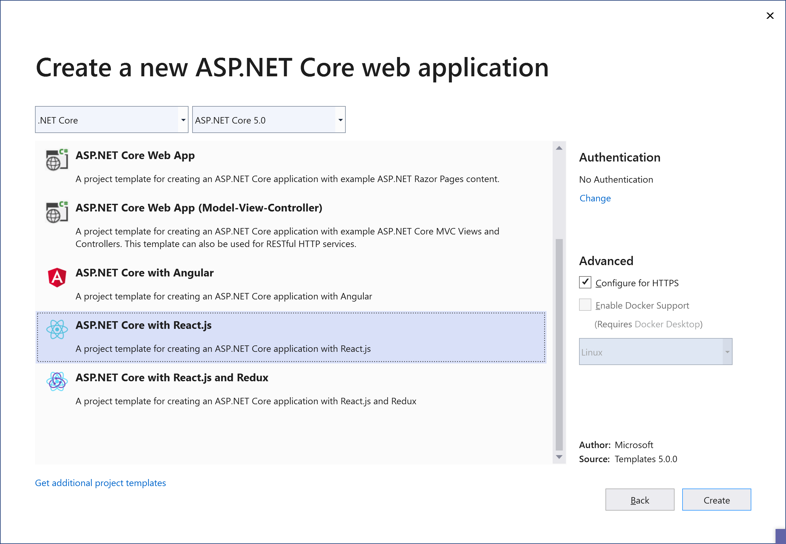
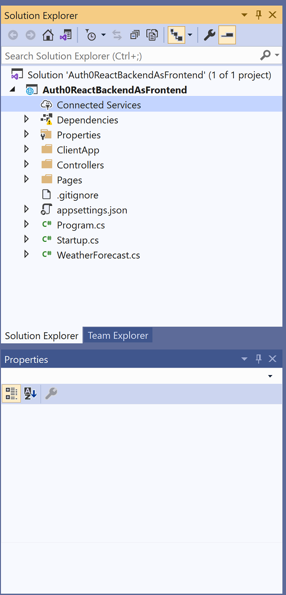
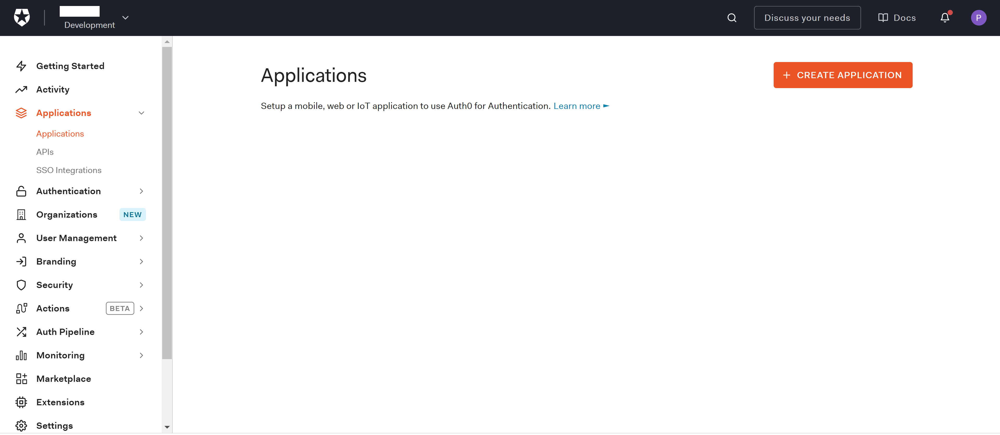
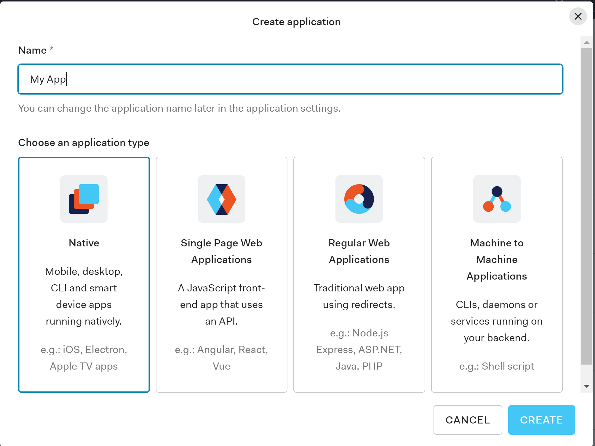
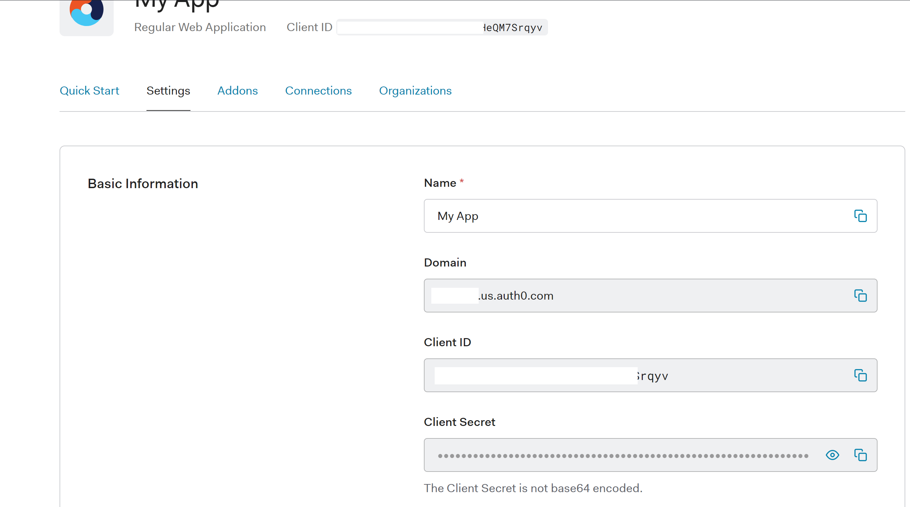
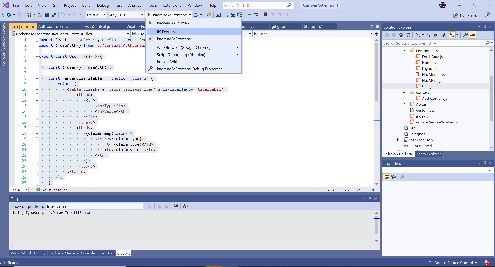

# Backend as Frontend Authentication Pattern with Auth0 and .NET 5.0

## What is the Backend As Frontend Authentication Pattern

As you start looking into the different OAuth flows and the scenarios they cover, client type is one of those relevant aspects mentioned everywhere. The [OAuth 2.1 specification](https://datatracker.ietf.org/doc/html/rfc6749) defines two different client types, public and confidential clients under the section #2.1.

Public clients are those that run in places where secrets could be exposed as part of the source code or if the binaries are decompiled. These usually are single page apps running in a browser, or native apps running in user devices such as mobile phones or smart TVs. 

On other hand, confidential clients are the ones with the ability to keep secrets in a private store. For example, a web application running in a web server, which can store secrets on the backend. 

The client type will determine one or more OAuth flows suitable for the application implementation. By sticking to one of those flows, you  can also ensure your application will be remain secure from authentication standpoint.

The Backend As FrontEnd pattern (a.k.a BFF) for authentication emerged to mitigate any risk that may occur from negotiating and handling access tokens from public clients running in a browser.  The name also implies that a dedicated backend must be available for performing all the authorization code exchange and handling of the access and refresh tokens.

The connection between the application running in the browser (frontend) and backend is a encrypted session cookie, which will rely on a all the protection mechanisms offered by the browser.

This pattern does  work for a pure SPA that relies on calling external APIs directly from javascript or a serveless backend (e.g AWS Lamba or Azure Functions).

## Backend As FrontEnd in .NET 5.0

Visual Studio ships with three templates for SPAs with a .NET Core backend. Those are ASP.NET Core with Angular, ASP.NET Core with React.js and ASP.NET Core with React.js and Redux, which includes all the necessary plumbing for using Redux.

> Available templates for SPA and .NET Core



As part of this article, we will be discussing how to implement this pattern with the ASP.NET Core with React.js template.

### The structure of the project

Projects created with that template from Visual Studio will have the following structure.



- ClientApp, this folder contains a sample SPA implemented with React.js. This is the app that we will modify to support the BBF pattern.
- Controllers, this folder contains the controllers implemented with ASP.NET Core for the API consumed from the SPA. On other words, it's the backend.
- Pages, this folder contains server side pages, which are mostly used for rendering errors on the backend.
- Startups.cs, this is the main class where the ASP.NET Core Middleware classes are configured as well as the dependency injection container.

Before modifying any code, we will proceed to configure first our application in Auth0. That configuration will give us access to the keys and authentication endpoints for the OpenID middleware in .NET Core.

### Auth0 Configuration

#### Create an application in the Auth0 Dashboard

The first thing we will do is to create a new brand application in the Auth0 dashboard. An application is an entry point for getting the keys and endpoints we will need in our web application.
Go to your Auth0 dashboard, click on the *Applications* menu on the left and then *Create Application*.



The *Create Application* button will start a wizard to define the configuration of a our application. Pick a name for your web application, and select the option *Regular Web Applications*. Do not confuse your application with Single Page Web Applications. Even we are going to implement an SPA with React, we will rely on the .NET Core Backend for negotiating the ID tokens. When choosing *Regular Web Applications*, we are telling Auth0 that our application will use the Authorization Code Flow that requires a backend channel to receive the ID token for OpenID Connect, and that is exactly what we need to get that magic happening in our .NET Core backend.

 

Once the application is created, go to the *Settings* tab and take not of the following settings, 

- Domain
- Client ID 
- Client Secret



Those are the ones you will need to configure the OpenID middleware in the web application.

#### Configure the Callback URL

Next thing is to configure the Callback URL for our web application. This is the URL where Auth0 will post the authentication code and ID token for OpenID connect. 
This URL can be added in the Allowed URLs field for our application. For our sample, we will use https://localhost:5001/callback. If you are planning to deploy the application to a different URL, you will also need to ensure it is listed here.

#### Configure the Logout URL

The logout URL is where Auth0 will redirect the user after the logout process has been completed.  Our web application will pass this URL to Auth0 as part of the *returnTo* query string parameter. This URL must also listed under return to after the user has been logged out of the authorization server. This is specified in the returnTo query parameter. The logout URL for your app must be added to the Allowed Logout URLs field under the application settings, or Auth0 will return an error otherwise when the user tries to do a logout. For our sample, we will use https://localhost:5001.

### Configuring the .NET Core Web Application

Our application will use two middleware, the OpenID Connect Middleware for handling all the authentication handshake with Auth0 and the Authentication Cookie middleware for persisting the authentication session in a cookie also sharing it with the Frontend running React.

Open the Package Manager Console for Nuget in Visual Studio and run the following command

```
Install-Package Microsoft.AspNetCore.Authentication.Cookies
Install-Package Microsoft.AspNetCore.Authentication.OpenIdConnect
```

Once the Nuget packages are installed in our project, we can go ahead and configure the middleware in the Startup.cs class.

Modify the ConfigureServices method in that class to include the following code.

```c#
public void ConfigureServices(IServiceCollection services)
{
  services.AddAuthentication(options => {
    options.DefaultAuthenticateScheme = 
       CookieAuthenticationDefaults.AuthenticationScheme;
    options.DefaultSignInScheme = 
       CookieAuthenticationDefaults.AuthenticationScheme;
    options.DefaultChallengeScheme = 
       CookieAuthenticationDefaults.AuthenticationScheme;
  })
  .AddCookie()
  .AddOpenIdConnect("Auth0", options => {
    // Set the authority to your Auth0 domain
    options.Authority = $"https://{Configuration["Auth0:Domain"]}";

    // Configure the Auth0 Client ID and Client Secret
    options.ClientId = Configuration["Auth0:ClientId"];
    options.ClientSecret = Configuration["Auth0:ClientSecret"];

    // Set response type to code
    options.ResponseType = OpenIdConnectResponseType.Code;

    // Configure the scope
    options.Scope.Clear();
    options.Scope.Add("openid");

    // Set the callback path, so Auth0 will call back to http://localhost:5001/callback
    // Also ensure that you have added the URL as an Allowed Callback URL in your Auth0 dashboard
    options.CallbackPath = new PathString("/callback");

    // Configure the Claims Issuer to be Auth0
     options.ClaimsIssuer = "Auth0";

     options.Events = new OpenIdConnectEvents
     {
       // handle the logout redirection
       OnRedirectToIdentityProviderForSignOut = (context) =>
       {
          var logoutUri = $"https://{Configuration["Auth0:Domain"]}/v2/logout?client_id={Configuration["Auth0:ClientId"]}";

          var postLogoutUri = context.Properties.RedirectUri;
          if (!string.IsNullOrEmpty(postLogoutUri))
          {
              if (postLogoutUri.StartsWith("/"))
              {
                // transform to absolute
                var request = context.Request;
                postLogoutUri = request.Scheme + "://" + request.Host + request.PathBase + postLogoutUri;
               }
               logoutUri += $"&returnTo={ Uri.EscapeDataString(postLogoutUri)}";
           }

           context.Response.Redirect(logoutUri);
           context.HandleResponse();

           return Task.CompletedTask;
                    }
                };
            });

            services.AddControllersWithViews();

            // In production, the React files will be served from this directory
            services.AddSpaStaticFiles(configuration =>
            {
                configuration.RootPath = "ClientApp/build";
            });
 }
```
All this code might look complex at first glance, but the only thing it does is to configure the OpenID Middleware to point to Auth0 and persist the authentication session in cookies. It also relies on some settings that we will configure later in the appSettings.json file associated to the application.

Next step is to modify the Configure method to tell ASP.NET Core that we want to use the Authentication And Authorization Middleware. Those middleware will integrate automatically with the authentication session cookies.

Insert the following code as it shown below.

```c#
public void Configure(IApplicationBuilder app, IWebHostEnvironment env)
{
.....
app.UseRouting();

// Code goes here
app.UseAuthentication();
app.UseAuthorization();

app.UseEndpoints(endpoints =>
{
  endpoints.MapControllerRoute(
    name: "default",
    pattern: "{controller}/{action=Index}/{id?}");
 });
....
}
```

Create a new appSettings.json file and include the settings we got from the Auth0 dashboard before. Those are *Domain*, *Client ID* and *Client Secret*.

```javascript
{
  "Logging": {
      "LogLevel": {
      "Default": "Information",
      "Microsoft": "Warning",
      "Microsoft.Hosting.Lifetime": "Information"
      }
    },
  "AllowedHosts": "*",
  "Auth0": {
    "Domain": "<domain>",
    "ClientId": "<client id>",
    "ClientSecret": "<client secret>"
  }
}
```

### Add the ASP.NET Core Controllers for handling authentication

Create a new ASP.NET Controller and call it AuthController. This controller have three actions.

- Login for initiating the OpenID Connect Login handshake with Auth0
- Logout for logging out from the web application and also from Auth0
- GetUser for getting data about the authenticated user in session. This is an API that the React application will invoke to get the authentication context for the user.

This is the code for Login action.

```c#
public ActionResult Login(string returnUrl = "/")
{
  return new ChallengeResult("Auth0", new AuthenticationProperties() { RedirectUri = returnUrl });
}
```

It is an action that returns a ChallengeResult with the authentication schema to be used. In this case, it is Auth0, which is the schema we associated to our OpenID Connect Middleware in the Startup.cs class. This result is an built-in class shipped with ASP.NET Core to initiate an authentication handshake from the Authentication Middleware.

The logout action looks as follow.

```c#
[Authorize]
public ActionResult Logout()
{
  return new SignOutResult("Auth0", new AuthenticationProperties
  {
    RedirectUri = Url.Action("Index", "Home")
  });
}
```

It returns a SignOutResult that will log the user out of the application and also initiate the sign out process with Auth0. As it happened with the ChallengeResult, this SignOutResult is also a built-in result that the Authentication middleware will process. We also decorated the action with the [Authorize] attribute as it should only be invoked if the user is authenticated. 

Finally, the GetUser API code is the following.

```c#
public ActionResult GetUser()
{
  if (User.Identity.IsAuthenticated)
  {
    var claims = ((ClaimsIdentity)this.User.Identity).Claims.Select(c =>
                    new { type = c.Type, value = c.Value })
                    .ToArray();

    return Json(new { isAuthenticated = true, claims = claims });
 }

 return Json(new { isAuthenticated = false });
}
```

If the user is authenticated, it returns the user identity a set of claims. Otherwise, it just returns a flag indicating the user is not authenticated.

### Require authentication in other controllers

The WeatherForecast controller included in the template allows anonymous calls. For making it more interesting in our sample, we will convert it to require authenticated calls. Fortunatelly, that is as simple as adding a top level *[Authorize]* attribute in the class definition.

 ```c#
[ApiController]
[Authorize]
[Route("[controller]")]
public class WeatherForecastController : ControllerBase
{
```

### Securing the React application

So far we have added all the plumbing code on the backend to enable authentication with Auth0 using OpenID Connect. The backend handles user authentication and configures a cookie that we can share with the React app. We also added a *GetUser* API that can be used to determine whether the user is authenticated and get basic identity information about him/her.

#### React Context for Authentication

As authentication is a core concern that we will use across all the components in the React application, it makes sense to make it available as a global context using the context pattern. 
Create a *context* folder, and add a file *AuthContext.js* on it. Paste the following code on the file.

```javascript
import React, { useState, useEffect, useContext } from "react";

export const AuthContext = React.createContext();
export const useAuth = () => useContext(AuthContext);
export const AuthProvider = ({
    children
}) => {
    const [isAuthenticated, setIsAuthenticated] = useState();
    const [user, setUser] = useState();
    const [isLoading, setIsLoading] = useState(false);

    const getUser = async () => {
        const response = await fetch('/auth/getUser');
        const json = await response.json();

        setIsAuthenticated(json.isAuthenticated);
        setIsLoading(false);
        if (json.isAuthenticated) setUser(json.claims);
    }

    useEffect(() => {
        getUser();
    }, []);

    const login = () => {
        window.location.href = '/auth/login';
    }

    const logout = () => {
        window.location.href = '/auth/logout';
    }

    return (
        <AuthContext.Provider
            value={{
                isAuthenticated,
                user,
                isLoading,
                login,
                logout
            }}
        >
            {children}
        </AuthContext.Provider>
    );
};
```
This context object provides methods for starting the login and logout handshake with the backend, and getting the authenticated user.

Modify the index.js file to reference this context provider.

```javascript
ReactDOM.render(
    <AuthProvider>
        <BrowserRouter basename={baseUrl}>
            <App />
        </BrowserRouter>
    </AuthProvider>,
    rootElement);
```

#### Add the Login and Logout routes

The React Router configuration uses the Authentication Context to redirect the user to login and logout URLs on the backend, and also forces the user authentication for routes that are private such as the one for fetching the weather. 

Modify the App.js file to include this code.

```javascript
import { Redirect, Route } from 'react-router';
import { Layout } from './components/Layout';
import { Home } from './components/Home';
import { FetchData } from './components/FetchData';
import { useAuth } from './context/AuthContext';

import './custom.css'

const App = () => {

    const { isAuthenticated, login, logout } = useAuth();

    return (
        <Layout>
            <Route exact path='/' component={Home} />
            <Route path='/fetch-data' component={isAuthenticated ? () => { return <FetchData /> } : () => { login(); return null; }}/>
            <Route path='/login' component={() => { login(); return null }} />
            <Route path='/logout' component={() => { logout(); return null }}></Route>
        </Layout>
    );
}

export default App;
```

The fetch-data route for example checks if the user is authenticated before returning the FectchData component. If the user is not authenticated, it calls the login function in the Auth context, which ultimately redirects the user to the Login URL in the backend.

#### Modify the application menu

Another feature that is very common in web application is to make menu options visible or not depending if the user is authenticated.
As we did in the React Router, the same thing can be accomplished for the menu options using the isAuthenticated function from the Auth Context.

Modify the NavMenu.js file to check the authentication status as it is shown below.

```javascript
return (
        <header>
            <Navbar className="navbar-expand-sm navbar-toggleable-sm ng-white border-bottom box-shadow mb-3" light>
                <Container>
                    <NavbarBrand tag={Link} to="/">Auth0 Backend as Frontend Authentication</NavbarBrand>
                    <NavbarToggler onClick={toggleNavbar} className="mr-2" />
                    <Collapse className="d-sm-inline-flex flex-sm-row-reverse" isOpen={!collapsed} navbar>
                        <ul className="navbar-nav flex-grow">
                            <NavItem>
                                <NavLink tag={Link} className="text-dark" to="/">Home</NavLink>
                            </NavItem>
                            <NavItem>
                                <NavLink tag={Link} className="text-dark" to="/fetch-data">Fetch data</NavLink>
                            </NavItem>
                            <NavItem>
                            {!isAuthenticated && <NavItem>
                                <NavLink tag={Link} className="text-dark" to="/login">Login</NavLink>
                            </NavItem>}
                            {isAuthenticated && <NavItem>
                                <NavLink tag={Link} className="text-dark" to="/logout">Logout</NavLink>
                            </NavItem>}
                        </ul>
                    </Collapse>
                </Container>
            </Navbar>
        </header>
```

#### Add a Component to show user data

The Auth Context provides a getUser function in case you want to show user's basic data coming from Auth0 on the React application. That function returns a collection of claims about the user's identity, which is coming from the backend API *getUser*. 

The following code shows a component that enumerates those claims.

```javascript
import React, { useEffect, useState } from 'react';
import { useAuth } from '../context/AuthContext';

export const User = () => {

    const { user } = useAuth();

    const renderClaimsTable = function (claims) {
        return (
            <table className='table table-striped' aria-labelledby="tabelLabel">
                <thead>
                    <tr>
                        <th>Type</th>
                        <th>Value</th>
                    </tr>
                </thead>
                <tbody>
                    {claims.map(claim =>
                        <tr key={claim.type}>
                            <td>{claim.type}</td>
                            <td>{claim.value}</td>
                        </tr>
                    )}
                </tbody>
            </table>
        );
    }

    return (
        <div>
            <h1 id="tabelLabel" >User claims</h1>
            <p>This component demonstrates fetching user identity claims from the server.</p>
            {renderClaimsTable(user)}
        </div>
    );

}
```

### Run the Web Application

From Visual Studio, click on the Run button but select your project name from the dropdown option instead of "IIS Express". That will run the application using the Kestrel, the built-in web server included in .NET Core. Kestrel runs on "https://localhost:5001", which is the URL we previously configured in Auth0.



#### About the login flow

- The user clicks on the Log In button and is directed to the Login route.
- The ChallengeResult tells the ASP.NET authentication middleware to issue a challenge to the authentication handler registered with the Auth0 authentication scheme parameter. The parameter uses the "Auth0" value you passed in the call to AddOpenIdConnect in the Startup class.
- The OIDC handler redirects the user to the Auth0 /authorize endpoint, which displays the Lock widget. The user can log in with their username and password, social provider or any other identity provider.
- Once the user has logged in, Auth0 calls back to the /callback endpoint in your application and passes along an authorization code.
- The OIDC handler intercepts requests made to the /callback path.
- The handler looks for the authorization code, which Auth0 sent in the query string.
- The OIDC handler calls the /oauth/token endpoint to exchange the authorization code for the user's ID and Access Tokens.
- The OIDC middleware extracts the user information from the claims on the ID Token.
- The OIDC middleware returns a successful authentication response and a cookie which indicates that the user is authenticated. The cookie contains claims with the user's information. The cookie is stored, so that the cookie middleware will automatically authenticate the user on any future requests. The OIDC middleware receives no more requests, unless it is explicitly challenged
- The React application uses the Auth Context to issue an API call to the getUser API. This API returns the user claims from the authentication cookie
- The React application renders the UI Component using the authenticated user's identity.
